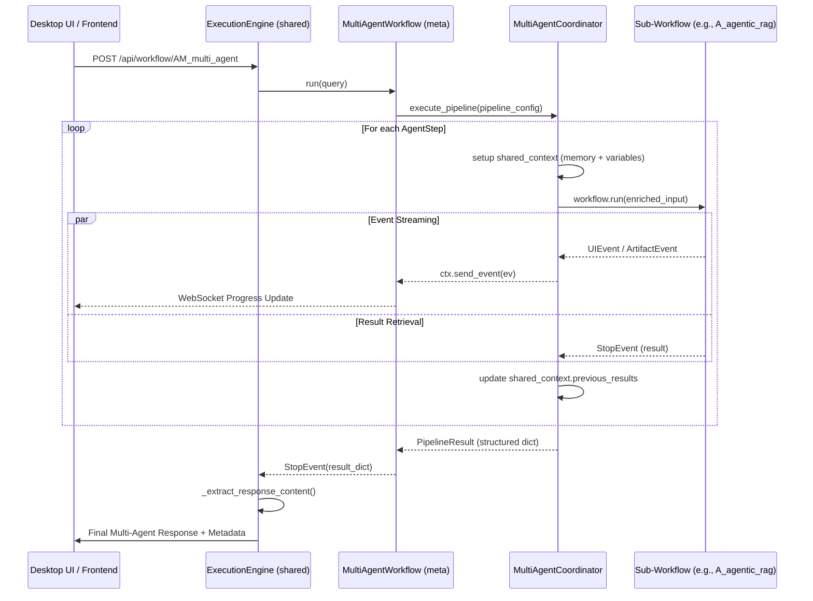

# Design Document: Multi-Agent Orchestration Workflow

This document outlines the current architecture, design philosophy, and future roadmap for the Multi-Agent Orchestration system within the Super Starter Suite.

## Overview
The Multi-Agent Orchestration workflow (`AM_multi_agent`) is designed to coordinate multiple specialized workflows (agents) into a unified pipeline. It leverages a shared memory context and a central coordinator to ensure continuity and logical flow across disparate tasks.

---

## Design Details (Multi-Agent Implementation)

The system is centered around the `MultiAgentCoordinator` which resides in `workflow_meta/multi_agent.py`. Unlike traditional workflows that handle a single task, this meta-workflow orchestrates the lifecycles of other workflows.

### 1. Code-Flow (Lifecycle)

The following diagram illustrates the lifecycle of a multi-agent execution from the UI request to the final response.

### 2. Data-Flow (Shared Memory)

Data is persisted and shared across agent boundaries through the `SharedMemoryContext`.

- **Input Data**: The original user query is passed to the first agent. Subsequent agents receive either the original query or transformed outputs from previous steps.
- **Shared Variables**: A dictionary (`shared_variables`) that persists throughout the pipeline. Any agent can read from or write to this store (e.g., a "Researcher" agent writes `found_links`, and a "Writer" agent reads them).
- **Execution Log**: A detailed trace of every step, timestamped and categorized, used to generate the final `pipeline_info` metadata for the UI.
- **Unified Memory**: All sub-agents share the *same* `ChatMemoryBuffer`. This is critical because it allows the LLM in a sub-agent to "remember" what was said in a previous step, even if that step used a different adapter.

---

## Current Architecture & "Meta" Integration

The `integrate_type = meta` designation in `system_config.toml` triggers a specific execution path in the `ExecutionEngine`.

### Shared Execution Logic
- **Dynamic Configuration**: The `ExecutionEngine` fetches the `meta` module and calls its `create_workflow` factory.
- **Metadata Fusion**: The engine specifically looks for a `pipeline_info` key in the result dictionary. If found, it merges this into the `enhanced_metadata` which the UI uses to render the multi-stage progress track.
- **Extraction Priority**: For `meta` workflows, the engine prioritizes extracting the "final synthesis" response, ensuring the user sees a coherent summary rather than a raw dump of sub-agent outputs.

### Limitations of the Current "Meta" Design
While powerful, the current implementation has architectural bottlenecks for future scaling:

1. **Static DAGs**: `PipelineConfig` currently supports Sequential, Parallel, and simple Conditional transitions. It lacks a true Graph (DAG) executor that can handle multi-input/multi-output dependencies dynamically.
2. **Configuration Rigidity**: Transitions are currently defined in code within `run_pipeline`. Future extensions will require moving these definitions to a database or dynamic DSL (Domain Specific Language) passed in the request.
3. **Event Propagation Constraints**: Re-emitting events is "one-way". The parent cannot currently *intercept* a sub-agent event to modify the sub-agent's behavior mid-flight (e.g., stopping a researcher if a link looks malicious).
4. **MCP Lifecycle Management**: The current engine assumes MCP tools are statically available. A full meta-orchestrator should manage the lifecycle (spawn/kill) of MCP servers based on the agents being invoked.

---

## Future Extensions: Agentic Business Logic

We envision a more sophisticated "Agentic Factory" pattern for complex engineering and business tasks:

### 1. Specialized Roles
- **Requirement Agent**: Interacts with the user to refine vague requests into precise engineering statements and success criteria.
- **Execution Agent**: The "worker" agents (like `A_agentic_rag` or `A_code_generator`) that perform the technical tasks.
- **Output Agent**: Formats the technical output into finalized deliverables (PDFs, Markdown, Git commits).
- **Review Agent**: A "Quality Gate" that examines the output against the original Requirements Agent's statements. If criteria aren't met, it triggers a **Retry/Correction Loop** with specific feedback for the Execution Agent.

### 2. Recursive Multi-Agents
Future `meta` workflows may invoke *other* `meta` workflows, creating a fractal orchestration layer for massive enterprise systems.

---

## MCP Integration & Tool Handling

Integrating the **Model Context Protocol (MCP)** will expand the capability of agents to interact with the real world:

### 1. Data & Infrastructure Tools
- **SQL Agent**: An MCP-connected agent that can safely query databases, explain schemas, and generate data visualizations.
- **BASH/Terminal Agent**: Executes shell commands in a sandboxed environment for environment setup, file manipulation, and system diagnostics.

### 2. Real-time Information
- **Web Query Agent**: Uses MCP tools for live web searches (SerpApi, Brave Search) to supplement internal RAG indices with the latest information.
- **File System Agent**: Deeply integrates with the local workspace to perform large-scale refactors, documentation audits, and multi-file analysis.
