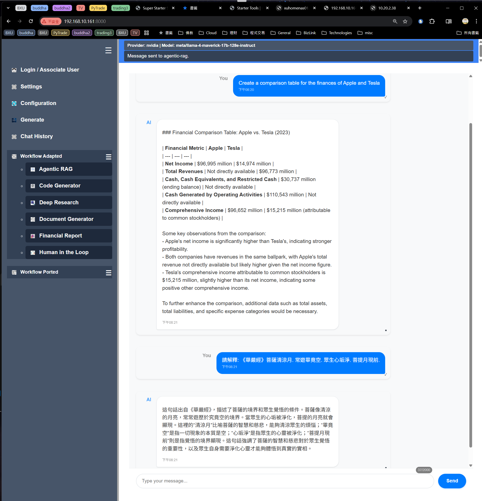

# `super_starter_suite`: A Unified Multi-User FastAPI Platform for LlamaIndex RAG Workflows

---

## 🎯 **Project Overview**

`super_starter_suite` is an innovative, multi-user FastAPI server designed to centralize and streamline the deployment of LlamaIndex RAG (Retrieval-Augmented Generation) applications. It consolidates six distinct RAG workflows into a single, cohesive web platform, offering shared infrastructure, robust user isolation, and a modern, responsive user experience. This project, notably developed through **vibe-coding with VS-Code/CLINE**, aims to provide a scalable and extensible foundation for AI-powered document intelligence, making advanced RAG capabilities accessible and manageable for diverse user groups and development teams.

---

## 🏗️ **Architectural Highlights**

The platform is built on a resilient multi-tier architecture, ensuring high performance, scalability, and maintainability:

### **Core Design Principles**
-   **Multi-Tier Structure**: Separates concerns across a Vanilla JavaScript SPA frontend, a FastAPI backend utilizing an MVC pattern for RAG operations, and a LlamaIndex-powered data layer.
-   **Modular Workflow Integration**: Supports dual-mode integration (Adaptive and Porting) for seamless inclusion of various RAG workflows.
-   **Event-Driven System**: Facilitates clean inter-process communication between components, enhancing responsiveness and decoupling.
-   **Session-Based Architecture**: Ensures robust per-user state management, providing isolated and consistent experiences.
-   **Layered Configuration**: Implements a flexible configuration system with system, user, and runtime settings, allowing for granular control and customization.

### **Key Architectural Patterns**
-   **MVC Pattern**: Clearly defines Model (business logic), View (frontend), and Controller (WebSocket/API) responsibilities for RAG operations.
-   **Configuration Layering**:
    ```
    System Config ← User Settings ← Runtime State ← Session Objects
    (system_config.toml) ← (settings.{user}.toml) ← (user_state.toml) ← (FastAPI request.state)
    ```

---

## 👥 **Multi-User System & Isolation**

`super_starter_suite` is engineered for multi-user environments, providing strong isolation and personalized experiences:

### **User Identification & Management**
-   **IP-Based Identification**: Automatically identifies users via client IP addresses.
-   **Configurable Mapping**: Allows for custom IP-to-user associations via `user_mapping.toml`.
-   **Fallback Mechanism**: Unknown IPs are gracefully handled, defaulting to a "Default" user profile.

### **Per-User Isolation**
-   **Dedicated RAG Data**: Each user benefits from separate data and storage paths for their RAG indexes, preventing data cross-contamination.
-   **Independent Session State**: Ensures that user sessions are entirely independent, maintaining privacy and consistency.
-   **Persistent Workflow Selection**: User-specific current workflow selections are persisted across sessions.

---

## 🔍 **Core Features**

### **1. Dual-Mode Workflow Integration**

The platform offers a flexible approach to integrating diverse RAG workflows:

#### **Adaptive Mode (`workflow_adapters/`)**
-   **Source**: Integrates existing workflows from the `STARTER_TOOLS/` directory with minimal modifications.
-   **Mechanism**: Utilizes light wrappers to bridge existing `llama_index.server` implementations to the main server.
-   **Benefit**: Preserves original functionality and frameworks, offering a smooth migration path for existing LlamaIndex applications.

#### **Porting Mode (`workflow_porting/`)**
-   **Source**: Features native rewrites of business logic, optimized for the `super_starter_suite` environment.
-   **Mechanism**: Implements self-contained workflows using `llama_index.core`.
-   **Advantage**: Reduces external dependencies, provides greater control, and enhances performance and maintainability.

**Six Integrated Workflows:**
-   `agentic_rag`: Advanced question-answering capabilities.
-   `code_generator`: AI-powered code generation.
-   `deep_research`: Comprehensive research assistance.
-   `document_generator`: Automated document creation.
-   `financial_report`: Specialized financial analysis and reporting.
-   `human_in_the_loop`: Interactive AI collaboration tools.

### **2. Robust RAG Generation Pipeline**

A sophisticated pipeline manages the entire RAG lifecycle, from index creation to interactive querying:

#### **Generation Stages**
-   **📥 GENERATE**: Manages long-running index creation from various source documents.
    -   **Parser Support**: Integrates EasyOCR, LlamaParse, NvidiaAI, and GeminiAI parsers for diverse document types.
    -   **Backend**: Leverages async FastAPI background tasks for efficient processing.
    -   **Progress**: Provides real-time progress updates via WebSocket streaming, enhancing user experience.
-   **💬 CHATBOT**: Offers an interactive chat interface that utilizes pre-built RAG indexes.
    -   **Automatic Trigger**: Automatically initiates index generation if a RAG index is missing.
    -   **Seamless UX**: Ensures a smooth transition between generation and chatbot interaction stages.

#### **RAG Type Extensibility**
-   **Standard Types**: Supports predefined RAG types such as `RAG`, `CODE_GEN`, `FINANCE`, and `TINA_DOC`.
-   **User-Definable**: Allows for the creation of custom RAG types to accommodate different data sources and use cases.
-   **Structured Paths**: Organizes data and storage with `data.{RAG_TYPE}/` and `storage.{RAG_TYPE}/` paths for clarity and isolation.

### **3. Intuitive WebGUI System**

The user interface is designed for clarity, efficiency, and customization:

#### **Three-Panel Layout**
-   **Left Panel**: A collapsible menu for workflow selection and navigation.
-   **Top Panel**: A status bar displaying model information and real-time progress indicators.
-   **Right Panel**: The main content area, dynamically updated with workflow-specific UIs.

#### **UI Features**
-   **Multi-Theme Support**: Offers 10 distinct theme combinations (2 styles × 5 colors) for personalized aesthetics.
-   **Configuration Management**: Provides full CRUD (Create, Read, Update, Delete) capabilities for user and system settings.
-   **ChatBot Interface**: A conversational UI with robust session management.
-   **Progress Visualization**: Real-time generation progress is visually represented with stateful styling.

#### **Progress State System**
```
Ready (White) → Parser (Green) → Generation (Orange) → Completed/Error (Red)
```

### **4. Advanced Metadata & Consistency System**

Ensures data integrity and optimizes RAG index regeneration:

#### **Smart RAG Regeneration**
-   **Metadata Tracking**: Monitors file changes, timestamps, and content hashes to detect modifications.
-   **Consistency Validation**: Automatically identifies mismatches between source data and RAG storage.
-   **Auto-Regeneration**: Intelligently repairs inconsistent metadata, minimizing manual intervention.
-   **Performance Optimization**: Offers configurable scan depths (minimal/fast/balanced/full) to balance thoroughness and speed.

#### **File Change Detection Logic**
```python
# Compares: storage_hash ↔ data_newest_time ↔ rag_storage_creation
if data_newer_than_storage:
    status = "Need Generate"  # Triggers regeneration
```

---

## 📊 **Key Technologies**

| Component | Technology |
|-----------|------------|
| **Backend** | FastAPI, Python 3.12 |
| **Frontend** | Vanilla JS, HTML5, CSS3 |
| **RAG Engine** | LlamaIndex (v0.10.x+) |
| **AI Models** | NvidiaAI, GeminiAI, OpenAI, Anthropic |
| **Real-Time** | WebSocket communication |
| **Configuration** | TOML files with layer inheritance |
| **Database** | File-based (No external DB required) |
| **Deployment** | Single Docker container |

---

## 📁 **Project Structure**

```
super_starter_suite/
├── config/                 # TOML configuration files (Global, User, IP mapping)
├── shared/                 # Common infrastructure (Config, DTOs, RAG utilities)
├── rag_indexing/           # RAG generation pipeline (Endpoints, WebSockets, Manager, Tracker)
├── workflow_adapters/      # Adaptive workflow integration (Wrappers for STARTER_TOOLS)
├── workflow_porting/       # Natively ported workflows (Optimized LlamaIndex implementations)
├── frontend/static/        # Web UI assets (HTML, CSS, JS, themes)
└── doc/                    # Project documentation and design artifacts
```

---

## 🔐 **Security & Performance**

### **Multi-User Isolation**
-   **Complete Separation**: Ensures each user operates within their own data directories and sessions.
-   **No Cross-Contamination**: Guarantees that sessions cannot access other users' RAG indexes.
-   **IP-Based Authentication**: Provides a straightforward yet effective method for user identification.

### **Performance Optimizations**
-   **Async Architecture**: Built entirely on `async/await` for high concurrency and responsiveness.
-   **Session Caching**: Reduces filesystem operations by caching metadata.
-   **Batch Processing**: Enables parallel file hashing for efficient metadata generation.
-   **Configurable Depth**: Optimizes scanning for various use cases, from minimal to full data integrity checks.

### **Error Handling**
-   **Graceful Degradation**: Designed to maintain core functionality even when errors occur.
-   **Detailed Logging**: Provides comprehensive error tracking and debugging information.
-   **Recovery Mechanisms**: Includes auto-regeneration capabilities for corrupted metadata.

---

## 🚀 **Workflow Management**

### **Adaptive Integration**
-   Seamlessly bridges existing `STARTER_TOOLS/` code with minimal changes.
-   Preserves original functionality and frameworks, facilitating easy adoption.

### **Porting Integration**
-   Features clean rewrites using modern LlamaIndex patterns for enhanced efficiency.
-   Offers improved performance and maintainability for critical workflows.

### **UIManager for Workflows**
```javascript
// Automatic routing based on workflow selection
const workflowGroups = {
    adapted: ["agentic_rag", "code_generator", "deep_research", "document_generator", "financial_report", "human_in_the_loop"],
    ported: ["agentic_rag", "code_generator", "deep_research", "document_generator", "financial_report", "human_in_the_loop"]
};
```

---

## 📋 **Current Status & Development**

### **Completed Features (✓)**
-   ✅ Multi-user FastAPI server foundation.
-   ✅ Dual-mode workflow integration framework.
-   ✅ MVC-patterned RAG generation pipeline.
-   ✅ WebSocket real-time progress streaming.
-   ✅ Metadata consistency validation and auto-regeneration.
-   ✅ Multi-theme UI system with extensive customization.
-   ✅ Robust configuration management system.

### **In Development (⟳)**
-   ⟳ Chat history persistence across sessions.
-   ⟳ Advanced workflow state management.
-   ⟳ Performance optimization for large document sets.

### **Future Enhancements (📋)**
-   📋 Multi-model support and automatic switching.
-   📋 Advanced analytics and usage tracking.
-   📋 Plugin architecture for custom workflows.

---

## 🏆 **Key Achievements**

1.  **Unified Architecture**: Successfully integrated and harmonized six independent LlamaIndex RAG applications into a single, powerful platform.
2.  **Robust User Isolation**: Achieved complete separation of user data and sessions, ensuring privacy and preventing cross-contamination.
3.  **Real-Time User Experience**: Implemented WebSocket-powered live progress updates, providing an engaging and responsive UI.
4.  **Intelligent Metadata Management**: Developed an automatic change detection system that prevents unnecessary RAG index regeneration, optimizing resource usage.
5.  **Flexible Integration**: Created a dual-mode approach that supports both legacy and modern LlamaIndex codebases, offering unparalleled adaptability.
6.  **Scalable & Extensible Design**: Engineered a modular architecture that facilitates easy extension, maintenance, and future enhancements.

---

## 🎯 **Project Mission**

**`super_starter_suite` is committed to delivering a production-ready, multi-user RAG server that:**
-   **Unifies** disparate LlamaIndex applications under a single, efficient roof.
-   **Preserves** existing functionality while enabling continuous innovation and future enhancements.
-   **Provides** enterprise-grade user isolation, reliability, and data integrity.
-   **Delivers** a modern, intuitive user experience with real-time feedback and responsive design.
-   **Maintains** a clean, testable, and extensible architecture for long-term viability and community contributions.

---

## 🖼️ **Project Visuals**

### Origin of Super Starter Suite Project

-   Discrete FastAPI application
-   Put together under `STARTER_TOOLS` folder of this project


### Super Starter Suite Project - Main UI and ChatBot




### System Configuration


### User Settings - Multi-Themes


### User Settings - Multi-Users


### RAG Index Generation


### Chat History


---

**`super_starter_suite` is not just a FastAPI application—it's a comprehensive platform that transforms how organizations deploy, manage, and scale their AI-powered document intelligence workflows.** 🚀✨
