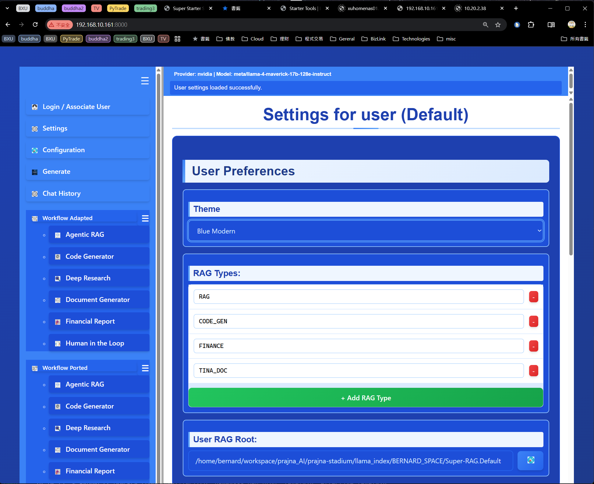

## **Project Description: `super_starter_suite`**

---

## 🎯 **Core Purpose**

**`super_starter_suite`** is a **unified, multi-user FastAPI server** that consolidates six independent LlamaIndex RAG (Retrieval-Augmented Generation) applications into a single, cohesive web application with shared infrastructure and modern UX.

---

## 🏗️ **Architecture Overview**

### **Multi-Tier Design**
- **Frontend**: Vanilla JavaScript SPA with modular HTML/CSS
- **Backend**: FastAPI with MVC pattern for RAG operations  
- **Data Layer**: LlamaIndex-powered RAG indexing and retrieval
- **Workflow Layer**: Dual-mode integration (Adaptive + Porting)

### **Key Architectural Patterns**
- **MVC Pattern**: Model (business logic), View (frontend), Controller (WebSocket/API)
- **Event-Driven System**: Clean IPC between components
- **Session-Based Architecture**: Per-user state management
- **Configuration Layering**: System + User + Runtime settings

---

## 👥 **Multi-User System**

### **User Identification**
- **IP-Based**: Automatic user identification via client IP
- **Configurable Mapping**: `user_mapping.toml` for IP-to-user associations
- **Fallback**: Unknown IPs default to "Default" user

### **Configuration Architecture**
```
System Config ← User Settings ← Runtime State ← Session Objects
(system_config.toml) ← (settings.{user}.toml) ← (user_state.toml) ← (FastAPI request.state)
```

### **Per-User Isolation**
- **RAG Data**: Separate data/storage paths per user
- **Session State**: Independent sessions with no cross-contamination
- **Workflow Selection**: User-specific current workflow persistence

---

## 🔍 **Core Features**

### **1. Dual-Mode Workflow Integration**

#### **Adaptive Mode (workflow_adapters/)**
- **Source**: `STARTER_TOOLS/` directory (6 original workflows)
- **Mechanism**: Light wrappers that bridge existing code to main server
- **Frameworks**: Preserves original `llama_index.server` implementations

#### **Porting Mode (workflow_porting/)**  
- **Source**: Native rewrite of business logic
- **Mechanism**: Self-contained implementations using `llama_index.core`
- **Advantage**: No external dependencies, better control

**Six Integrated Workflows:**
- `agentic_rag` - Advanced question-answering
- `code_generator` - AI-powered code generation
- `deep_research` - Comprehensive research assistant
- `document_generator` - Automated document creation
- `financial_report` - Financial analysis and reporting
- `human_in_the_loop` - Interactive AI collaboration

### **2. RAG Generation Pipeline**

#### **Generation Stages**
- **📥 GENERATE**: Long-running index creation from source documents
  - Support: EasyOCR, LlamaParse, NvidiaAI, GeminiAI parsers
  - Backend: Async FastAPI background tasks
  - Progress: Real-time WebSocket streaming

- **💬 CHATBOT**: Interactive chat interface with pre-built RAG indexes
  - Trigger: Automatic if RAG index missing
  - UX: Seamless switch between stages

#### **RAG Type Extensibility**
- **Standard Types**: `RAG`, `CODE_GEN`, `FINANCE`, `TINA_DOC`
- **User-Definable**: Custom RAG types for different data sources
- **Path Structure**: `data.{RAG_TYPE}/` and `storage.{RAG_TYPE}/`

### **3. WebGUI System**

#### **Three-Panel Layout**
- **Left Panel**: Collapsible menu with workflow/navigation buttons
- **Top Panel**: Status bar with model info and progress indicators  
- **Right Panel**: Main content area for workflow UIs

#### **UI Features**
- **Multi-Theme Support**: 10 theme combinations (2 styles × 5 colors)
- **Configuration Management**: Full CRUD for user/system settings
- **ChatBot Interface**: Conversational UI with session management
- **Progress Visualization**: Real-time generation progress with stateful styling

#### **Progress State System**
```
Ready (White) → Parser (Green) → Generation (Orange) → Completed/Error (Red)
```

### **4. Metadata & Consistency System**

#### **Smart RAG Regeneration**
- **Metadata Tracking**: File changes, timestamps, and content hashes
- **Consistency Validation**: Automatic detection of data vs storage mismatches  
- **Auto-Regeneration**: Smart repair of inconsistent metadata
- **Performance Optimization**: Configurable scan depths (minimal/fast/balanced/full)

#### **File Change Detection**
```python
# Compares: storage_hash ↔ data_newest_time ↔ rag_storage_creation
if data_newer_than_storage:
    status = "Need Generate"  # Trigger regeneration
```

---

## 📊 **Key Technologies**

| Component | Technology |
|-----------|------------|
| **Backend** | FastAPI, Python 3.12 |
| **Frontend** | Vanilla JS, HTML5, CSS3 |
| **RAG Engine** | LlamaIndex (v0.10.x+) |
| **AI Models** | NvidiaAI, GeminiAI, OpenAI, Anthropic |
| **Real-Time** | WebSocket communication |
| **Configuration** | TOML files with layer inheritance |
| **Database** | File-based (No external DB required) |
| **Deployment** | Single Docker container |

---

## 📁 **Project Structure**

```
super_starter_suite/
├── config/                 # TOML configuration files
│   ├── system_config.toml  # Global settings
│   ├── settings.Default.toml # User template
│   └── user_mapping.toml   # IP-to-user mapping
├── shared/                 # Common infrastructure
│   ├── config_manager.py   # Configuration system
│   ├── dto.py             # Data transfer objects
│   └── index_utils.py     # RAG metadata management
├── rag_indexing/          # RAG generation pipeline
│   ├── generate_endpoint.py # REST API endpoints
│   ├── generate_websocket.py # Real-time progress
│   ├── generate_manager.py   # MVC model layer
│   └── progress_tracker.py   # Generation progress logic
├── workflow_adapters/     # Adaptive workflow integration
├── workflow_porting/      # Natively ported workflows
├── frontend/static/       # Web UI assets
└── doc/                   # Project documentation
```

---

## 🔐 **Security & Performance**

### **Multi-User Isolation**
- **Complete Separation**: Each user gets own data directories and sessions
- **No Cross-Contamination**: Sessions can't access other users' RAG indexes
- **IP-Based Authentication**: Simple but effective user identification

### **Performance Optimizations**
- **Async Everywhere**: Full async/await architecture
- **Session Caching**: Metadata caching reduces filesystem operations  
- **Batch Processing**: Parallel file hashing for metadata generation
- **Configurable Depth**: Scan optimization for different use cases

### **Error Handling**
- **Graceful Degradation**: System continues functioning during errors
- **Detailed Logging**: Comprehensive error tracking and debugging
- **Recovery Mechanisms**: Auto-regeneration of corrupted metadata

---

## 🚀 **Workflow Management**

### **Adaptive Integration** 
- Bridges existing `STARTER_TOOLS/` code with minimal changes
- Preserves original functionality and frameworks
- Easy migration path for legacy code

### **Porting Integration**
- Clean rewrites using modern LlamaIndex patterns
- Better performance and maintainability  
- Future-proof implementations

### **UIManager for Workflows**
```javascript
// Automatic routing based on workflow selection
const workflowGroups = {
    adapted: ["agentic_rag", "code_generator", ...],
    ported: ["agentic_rag", "code_generator", ...]
};
```

---

## 📋 **Current Status & Development**

### **Completed Features (✓)**
- ✅ Multi-user FastAPI server
- ✅ Dual-mode workflow integration framework  
- ✅ MVC-patterned RAG generation pipeline
- ✅ WebSocket real-time progress streaming
- ✅ Metadata consistency validation
- ✅ Multi-theme UI system
- ✅ Configuration management system

### **In Development (⟳)**
- ⟳ Chat history persistence across sessions
- ⟳ Advanced workflow state management
- ⟳ Performance optimization for large document sets

### **Future Enhancements (📋)**
- 📋 Multi-model support and automatic switching
- 📋 Advanced analytics and usage tracking
- 📋 Plugin architecture for custom workflows  

---

## 🏆 **Key Achievements**

1. **Unified Architecture**: Successfully merged 6+ independent RAG applications
2. **Clean User Isolation**: Zero cross-contamination between users
3. **Real-Time UX**: WebSocket-powered live progress updates
4. **Metadata Intelligence**: Automatic change detection prevents unnecessary regeneration
5. **Flexible Integration**: Dual-mode approach supports both legacy and modern codebases
6. **Future-Proof**: Modular design enables easy extension and maintenance

---

## 🎯 **Project Mission**

**Create a production-ready, multi-user RAG server that:**
- **Unifies** disparate LlamaIndex applications under one roof
- **Preserves** existing functionality while enabling future enhancements  
- **Provides** enterprise-grade user isolation and reliability
- **Delivers** modern UX with real-time progress and responsive design
- **Maintains** clean, testable, and extensible architecture

---

## 🎯 **Project Pictures**

### Origin of Super Starter Suite Project

- Discrete FastAPI application
- Put together under `STARTER_TOOLS` folder of this project


### Super Starter Suite Project - Main UI and ChatBot


### System Configuration


### User Settings - mutli-themes




### User Settings - multi-users


### RAG Index Generation


### Chat History


---

**`super_starter_suite` is not just a FastAPI application—it's a comprehensive platform that transforms how organizations deploy, manage, and scale their AI-powered document intelligence workflows.** 🚀✨
